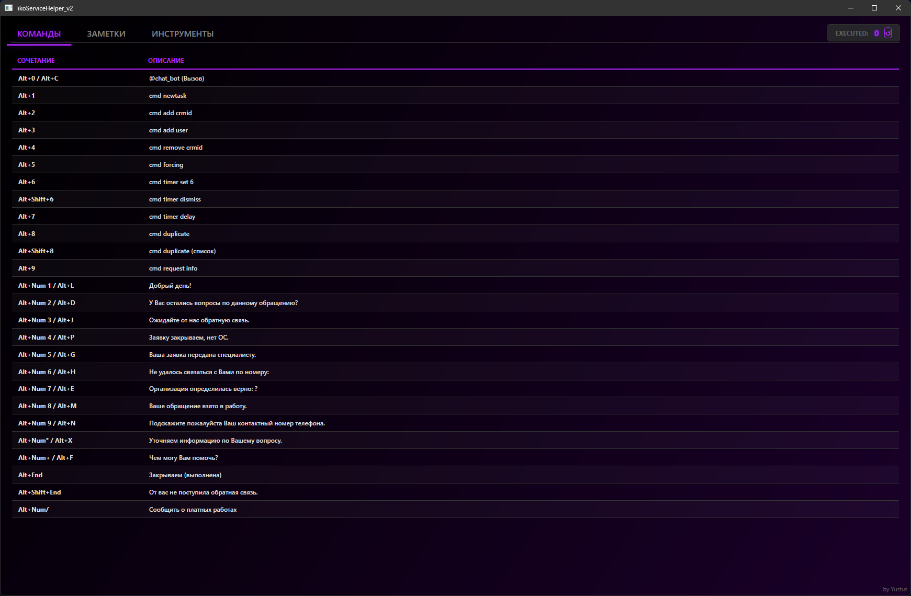

# iikoService Helper (C# WPF Edition)

Приложение для автоматизации ответов с GUI и системным треем, переписанное на .NET 6 (WPF).


## Требования

- Windows 10/11
- .NET SDK 6.0 (или новее)

## Разработка в VS Code

1. Установите расширение **C# Dev Kit**.
2. Нажмите `F5` для запуска отладки.

## Сборка

### 1. Portable (Автономная)
Размер: ~60 МБ. Работает сразу, ничего устанавливать не нужно.

   ```powershell
   dotnet publish iikoServiceHelper.csproj -c Release -p:EnableCompressionInSingleFile=true
   ```

### 2. Compact (Компактная)
Размер: **~3-5 МБ**. Требует установленного **.NET Desktop Runtime 6.0**.
*(Внимание: .NET Framework 4.8 не подходит)*

[Скачать .NET Desktop Runtime 6.0](https://dotnet.microsoft.com/en-us/download/dotnet/6.0)

**Авто-проверка:** Если у пользователя нет .NET 6, программа сама покажет окно с предложением скачать его.

   ```powershell
   dotnet publish iikoServiceHelper.csproj -c Release -p:SelfContained=false
   ```

### 3. Публикация на GitHub
По умолчанию команды выше собирают файлы **только локально**.
Чтобы автоматически создать тег, отправить его в репозиторий и создать **GitHub Release**, добавьте флаг `-p:GitHubRelease=true`:

   ```powershell
   dotnet publish iikoServiceHelper.csproj -c Release -p:GitHubRelease=true
   ```

### Где файл?
Готовые файлы будут лежать здесь:
`bin\Release\net6.0-windows10.0.19041.0\publish\`
(`iikoServiceHelper.exe` или `iikoServiceHelper_Compact.exe`)

## Логирование и Данные

Настройки и заметки хранятся в:
`%LOCALAPPDATA%\iikoServiceHelper\`

## Функционал

- **GUI**: WPF интерфейс с поддержкой **Светлой** и **Темной** тем.
- **Кастомизация**: Полная настройка цветов приложения через файл `theme_colors.json`.
- **Системный трей**: Сворачивание и фоновая работа (стилизованное меню).
- **Горячие клавиши**: Низкоуровневый перехват клавиатуры (работает поверх RDP/AnyDesk).
- **Макросы**: Автоматизация ввода текста и команд бота.
- **Alt Blocker**: Блокировка меню окна при нажатии Alt (предотвращает потерю фокуса в браузерах).
- **CRM Авто-вход**: Автоматическая авторизация в CRM (поддержка Chrome, Edge, Yandex) через отладочный порт.
- **Инструменты**:
  - Загрузка и запуск **OrderCheck** и **CLEAR.bat**.
  - Быстрое подключение к **FTP** (files.resto.lan).
  - Копирование ссылок на POS-инсталляторы.
- **Заметки**: Встроенный блокнот с автосохранением и масштабированием.
- **Управление**: Возможность временного отключения перехвата клавиш через трей.

---
